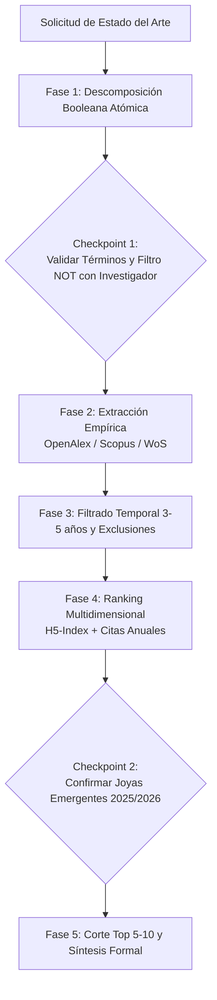

# Systematic Literature Review (SLR) Skill

Esta habilidad guía al agente en la ejecución rigurosa y procedimental del **Protocolo de Estado del Arte Sistematizado en 7 Pasos**, diseñado por investigadores experimentados para publicaciones en revistas de primer nivel (JCR/Scopus Q1/Q2).

---

## Flujo Operativo en 5 Fases



---

## Fase 1: Descomposición en Términos Atómicos (Anti-Lenguaje Natural)
1. **Regla Inviolable:** NUNCA ejecutes una búsqueda con frases en lenguaje natural (ej: *"algoritmos de optimización para redes de transporte usando grafos"* es incorrecto).
2. Extrae los **conceptos nucleares atómicos** (en inglés):
   - Dominio / Problema: ej. `transportation routing`
   - Técnica / Estructura: ej. `graph neural networks`
   - Modificador: ej. `dynamic`
3. Identifica **términos de exclusión negativa (`NOT`)** para purgar disciplinas adyacentes no deseadas (ej. excluir `mechanics`, `optics`, `chemistry`).
4. **Checkpoint 1:** Presenta la ecuación de búsqueda al investigador antes de continuar:
   > *"He formulado la siguiente búsqueda booleana: `(transportation AND routing) AND (graph neural networks)` excluyendo `[mechanics, chemistry]`. ¿Deseas afinar los términos antes de extraer?"*

---

## Fase 2: Extracción y Recolección de Literatura
Elige la fuente según la disponibilidad:

### Opción A: Búsqueda Abierta (Vía OpenAlex - Sin API Key)
Ejecuta el script del arnés:
```bash
python skills/literature-harvester/scripts/search_openalex.py \
    --include <termino1> <termino2> \
    --exclude <excluir1> <excluir2> \
    --years 3 \
    --max 40 \
    --output investigations/<tema>/raw/articles.json
```
*Si se obtienen menos de 15 artículos pertinentes, amplía `--years` a 5.*

### Opción B: Ingesta de Scopus o Web of Science (Acceso Universitario)
Si el investigador exportó un archivo CSV o `.bib` desde la biblioteca institucional:
```bash
python skills/literature-harvester/scripts/import_scopus_wos.py \
    --input investigations/<tema>/raw/scopus_export.csv \
    --output investigations/<tema>/raw/articles.json
```

---

## Fase 3: Ranking Multidimensional de Prestigio
Ejecuta el algoritmo que cruza el impacto del paper con el prestigio de la revista:
```bash
python skills/literature-harvester/scripts/rank_and_filter.py \
    --input investigations/<tema>/raw/articles.json \
    --top 10 \
    --emerging 2 \
    --format markdown \
    --output investigations/<tema>/summary_table.md
```

### Factores de Ponderación:
* **Tasa de Citación Anual:** $\text{Citas} / (\text{Año Actual} - \text{Año Pub} + 1)$
* **Prestigio del Venue (H5-index):** Google Scholar Metrics (Revistas top > 100, medianas 40–90).
* **Bonus de Cuartil:** +25 puntos si es JCR/SJR Q1, +15 si es Q2.

---

## Fase 4: Checkpoint de Joyas Emergentes (2025–2026)
Los artículos más recientes aún no tienen citas acumuladas pero representan el verdadero estado del arte.
1. El script reserva automáticamente 1 o 2 puestos para **Joyas Emergentes** del año en curso.
2. **Checkpoint 2:** Pregunta al investigador:
   > *"El sistema ha preseleccionado 8 artículos de alto impacto y 2 joyas emergentes de 2025/2026. ¿Conoces algún preprint o artículo reciente específico sin citas que desees agregar manualmente al corte?"*

---

## Fase 5: Generación del Entregable
1. Genera el informe formal en `investigations/<tema>/report.md` utilizando la plantilla `.agent/templates/slr_report_template.md`.
2. Para cada artículo del Top 5–10, incluye:
   - Resumen del problema y algoritmo.
   - Datasets y baselines utilizados.
   - Brechas detectadas (*Research Gaps*).
   - Indicador de acceso: `🔓 Open Access` o `🔒 Paywall (Univ)` con enlace DOI para descarga universitaria.
